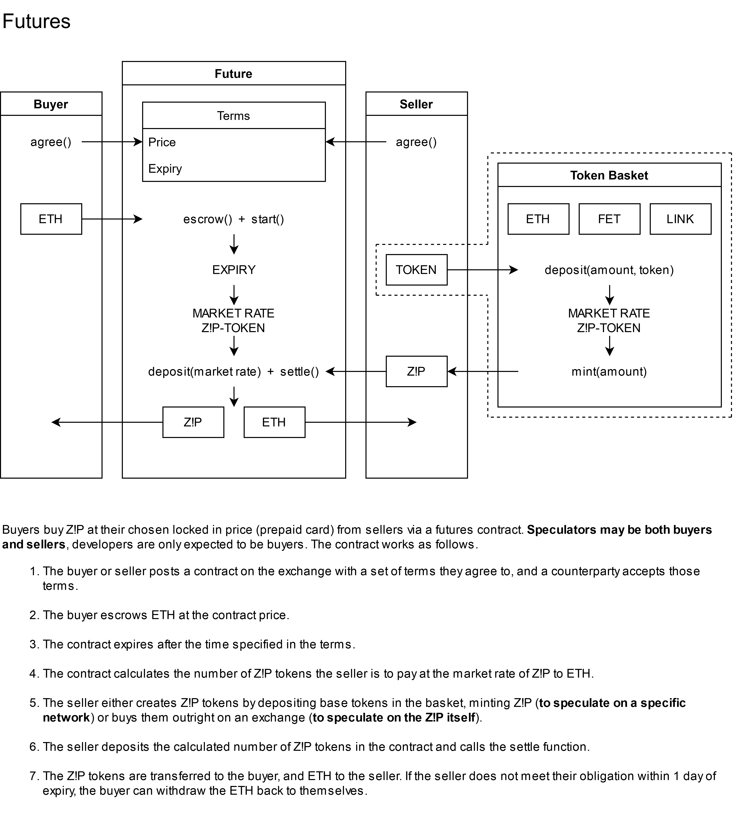

<p align="center">
    
    <br><br>
    <a href="#" alt="Cross-chain">
        
    </a>
    <a href="#" alt="Stable">
        
    </a>
    <a href="https://outlierventures.io" alt="Convergence ready">
        
    </a>
    <br><br>
    Blockchain cloud credits: a cross-chain stable token.<br><br>
    <i>An Outlier Ventures project.</i>
</p>


## Install

Requires Node.JS and Python.

```sh
pip3 install pandas matplotlib
npm i -g truffle
npm i @openzeppelin/contracts-ethereum-package @openzeppelin/upgrades
```

## Deploy contracts

```sh
truffle compile
truffle migrate
```

## Problem statement

To lower the barriers of adoption for creating and operating applications using multiple blockchain networks.  

Barriers to adoption and UX issues, in order of importance:

1. Complexity and friction of acquiring and managing multiple tokens.
2. Ledger cost volatility (gas costs).
3. Utility price volatility.

## Intended solution

1. A super-token redeemed for the relevant underlying token through smart contracts and the time of executing ledger operations.
2. A smart contract-based gas futures market to stabilise the cost of fees.
3. A fiat gateway/abstraction layer hiding the token cost, which ultimately should not be stabilised for the sake of investability.

<p align="center">
    
</p>

Note that token and gas price are not inherently correlated, only network congestion (which raises gas costs) tends to occur at the same time as token price increases due to increased trading volume. Stabilising gas costs will not stabilise token costs and vice versa.

## Supertoken functionality

The Supertoken is an ERC20-compliant token based largely on the OpenZeppelin reference for Solidity 0.5. It is a mint/burn model backed by a basket of tokens.

The Supertoken is a basket of tokens which may be used to pay for network fees, as well as ETH to cover gas. At any time, anyone may spend Supertokens as if they were their chosen underlying token (specified by that token's contract address) through a token allowance model. The deposited Supertokens are converted to the underlying tokens according to their market value in ETH. This price feed is achieved using Chainlink oracles. Similarly, underlying tokens may be deposited in the contract, minting Supertokens at the market rate for the depositor. Minimum token balances are required for mint/burn calls, and setting these minimum balances is only available to the contract owner (the value may be voted on using off-chain governance).

<p align="center">
    
</p>

The Supertoken thereby becomes an ERC20 token which may be used across any of the underlying networks by simply specifying the network at transaction time.

The stable pricing model applies a flat price updated quarterly (in development, see the `peg` folder). Deposits and withdrawals currently implement a 2.5% fee to cover gas costs and LINK token costs as an interim solution.

<p align="center">
    
</p>

### Gas Stations Network addition

The default Supertoken design is that users interact with any token in the stack using the Supertoken, but also have Ether in their wallet to cover the fees. This may be circumvented by implementing Gas Stations Network, however this significantly increases the complexity of the project, notably:

1. Gas Stations Network will need be to implemented for transactions after the Supertoken -> base swap takes place.
2. Token pool management and monetary policy will need to make a greater number of considerations for gas fees.

Implementing Gas Stations Network has a strong advantage in differentiating the project from Uniswap at the Ethereum token level.

## A note on using futures to stabilise gas

A futures market can be used as an alternate stabilisation mechanism. See `contracts/futures` for exploratory work. There are two options for stabilising gas using a futures market:

1. Accrual of gas itself through a refund exploit mechanism, as with [GasToken](https://github.com/projectchicago/gastoken). The gas is locked at the time of the futures contract's inception.
2. A right to gas token which may be redeemed for gas at the time of transaction execution by liquidating the funds locked in a futures contract (e.g. ETH).

The former is tried and tested, but relies on the ability to exploit refund mechanisms, which may be impossible on certain chains. The latter is inherently cross-chain compatible (by purchasing the relevant native chain token using the right to gas token, then using the native chain token to pay for gas). Notably, the second option also introduces significant transaction delay (on average doubling transaction time, assuming no exchange delay) as well as requires an actively traded token pair to function.

<p align="center">
    
</p>
Ultimately, a price peg (updated quarterly) as discussed above is a more viable solution.

## The benefits: without the Supertoken vs with the Supertoken

### Without the Supertoken

1. User wants to use network X.
2. User goes to an exchange and purchases token X.
3. User transfers token X to their wallet and waits for them to arrive.
4. User purchases a compute job on network X using token X.
5. User wants to use network Y.
6. User goes to an exchange and purchases token Y.
7. User transfers token Y to their wallet and waits for them to arrive.
8. User purchases a compute job on network Y using token Y.
9. User wants to use network Z.
10. User goes to an exchange and purchases token Z.
11. User transfers token Z to their wallet and waits for them to arrive.
12. User purchases a compute job on network Z using token Z.
...

In other words, the user needs to purchase a separate token and transfer it to their wallet every time they want to use a given network. They have to know the correct token to buy and where to buy it (which often differs depending on network). They also rack up significant gas fees and time cost.

### With the Supertoken

1. User purchases the Supertoken.
2. User uses the Supertoken on any of the underlying networks like a prepaid card.

A further benefit of the CStack token is that it may be purchased both as normal on an exchange, but may also be acquired by depositing any of the underlying tokens in exchange for the CStack token - no exchanges needed.

## Demo Dapp

There is a demo dapp in the demo folder. By default, this uses test RPC (node needs to be running); to use it on test/mainnet, deploy the dapp contract and supertoken contract to your net of choice. The demo dapp has two components:

1. `deploySupertoken`: Move supertokens around addresses. Send some to your wallet for use in the dapp.
2. `simpleDapp`: A dapp with a button that when pressed, transfers 100 FUEL to the dapp (normal metamask signing), and the dapp then spends it on FET.

## Roadmap: next up

1. GSN tests (see [OpenZeppelin](https://github.com/OpenZeppelin/openzeppelin-contracts/tree/master/test/GSN))
2. Token migration contract / wrapped asset.